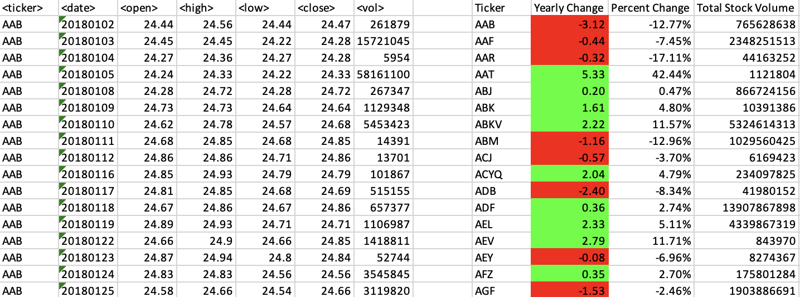

# MJW-2.C
Mj week 2 challenge
Apparently, I'm tasked with putting any vba files I use into the repsitory. Alright less go

It wants me to make a loop script through all of the stocks for one year and outputs the information following:
    The ticker symbol

    Yearly change from the opening price at the beginning of a given year to the closing price at the end of that year.
        This means its "open" price, it's Highest recorded price (in the timespan), the lowest, and the "closing" (ending) price. The changes aren't as drastic as you think.
    The percentage change from the opening price at the beginning of a given year to the closing price at the end of that year.

    The total stock volume of the stock. The result should match the following image:
        I can use pictures?? COOL!

A looping 'iteration' script
    it's called iteration because it goes from iteration to iteration, like a... loop! :o

    It's used to perform a group of tasks repeatedly a number of times ahhhh very handy
        I need to create something that
            (this information comes later)

    For now, let's focus on making loops
        it takes step one, and then repeating step two X times.
        ___________________________________________________________
        The rest is cut off, put aside as notes within the code themselves (arent I so smart and intelligent? :O)

        'Build the program!
        'Get Ingredients!
        dim ing 
            ' dim stands for DIMENSION!! "It is used to declare (a dimensions) variables in VBA. Declare means we are telling VBA about a variable we will use later.
